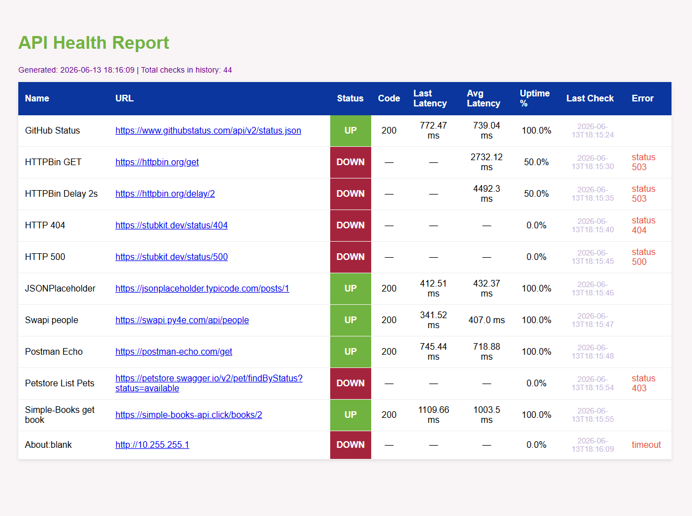

# API-Health Checker

A command-line tool for monitoring API endpoints availability — built to simulate
real support engineering workflows: checking response status, measuring latency, tracking uptime history, and generating diagnostic HTML reports.

## Features
	- Send HTTP GET requests to a list of endpoints
	- Retry failed requests before marking as DOWN
	- Measure response latency in milliseconds
	- Track uptime % and average latency across all checks
	- Save check history to JSON
	- Generate HTML report with color-coded status table

## Requirements
External libraries:
- `requests` — HTTP requests
- `jinja2` — HTML template rendering

Standard library:
- `json` — history storage
- `argparse` — CLI arguments
- `os` — file and directory operations
- `sys` — system exit on errors
- `time` — delay between retries
- `datetime` — timestamps
- `collections` — defaultdict for stats

## Usage

```bash
# Sending Get-requests to URLs and saving the results in json WITHOUT creating a report
python main.py --check

# Creating a report based on responses from a json file WITHOUT sending new GEt requests
python main.py --generate-report  

# Checking and saving the report to an HTML file
python main.py --check --generate-report

# Selecting another json file with urls
python main.py --file endpoints1.json --check --generate-report

# Choose another part to save json report
python main.py --output history1/results.json --check --generate-report

# Choose another path to save HTML report
python main.py --report reports1/report.html --check --generate-report

```

## Output
```
check=True, report=True
GitHub Status: UP
  Retry 1 for HTTPBin GET...
  Retry 2 for HTTPBin GET...
HTTPBin GET: DOWN
  Retry 1 for HTTPBin Delay 2s...
  Retry 2 for HTTPBin Delay 2s...
Simple-Books get book: UP
  Retry 1 for About:blank...
  Retry 2 for About:blank...
About:blank: DOWN
..

Saved 11 results in history/results.json
Report saved: reports/report.html
```


```
## Project structure
api-health-checker/
├── checker.py          # logic of checks and retry
├── reporter.py         # generating an HTML report
├── main.py             # entry point, CLI flags
├── endpoints.json      # list of endpoints
├── assets/
│   └── report_screenshot.png
├── history/
│   └── results.json    # results history
├── reports/
│   └── report.html     # finished report
└── templates/
    └── report.html     # Jinja2 template
```